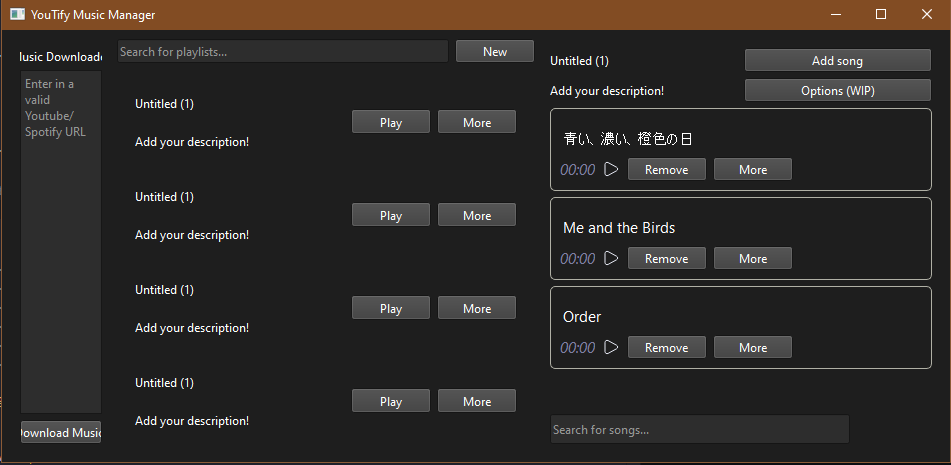

# YouTify Music Manager

An application, that downloads any YouTube video / Spotify track locally, and allows you to create, and customize playlists to play even offline. Made using Python, Qt, and yt-dlp for a friend of mine. In its current state - it is unusable, and once a satisfactory version is released - instructions on how to use, and configure it will be uploaded.

 
<i>A very beta look into how the application looks like</i>

## Usage

A satisfactory version hasn't been uploaded yet.

## Notes

Because Spotify doesn't have any way of downloading songs, instead, this application leverages the fact, that yt-dlp can instead use a song's name, and searches youtube for it instead. However - attempting to look up a spotify song still requires access to the spotify API, which means that a developer account is needed. At a later date - instructions on how to make a free account will be uploaded.

Additionaly, as YouTube changes its usage guidelines, this application might be considered "dangerous" by YouTube. So to get ahead of any issues cause by YouTube being annoyed: *Using this application may carry risk, and may possibly be against YouTube's usage guidelines. I am not responsible for any repercussions that come as a consequence of using this application. This is made as an educational and experimental project.*